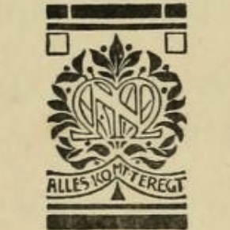
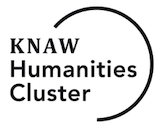

# The correspondence of Christofforo Suriano

In this repo we develop a website for the correspondence of Christofforo Suriano.

We proceed as follows:

1.  There are incoming transcriptions in Word
1.  They are converted to TEI
1.  The TEI is converted to Text-Fabric
1.  By means of Text-Fabric we generate a set of text fragments and annotations
    and import it into the systems of TeamText: AnnoRepo and TextRepo
1.  By means of Broccoli we make a configuration for a website
1.  Finally, TextAnnoViz displays the letters on the website, fed by the contents of
    AnnoRepo, TextRepo, Broccoli

There is a large degree of isomorphism between the Text-Fabric data and the final 
website data.

Researchers can use Text-Fabric to download the letters to their computer and browse
and search them in a local browser.
Or they can access them by means of Python programs and Jupyter notebooks.

We'll provide a set of tutorials for that.

# Curated data

The source data and the TEI that we derived from it and more is available on
[SurfDrive (public readonly link)](https://surfdrive.surf.nl/files/index.php/s/L1bhixOQKMdXPjT).

# About

[Project](https://www.huygens.knaw.nl/en/projecten/correspondence-of-christofforo-suriano/)

[Ph.D. thesis Pieter Geyl, 1913](https://archive.org/details/christofforosuri00geyl/page/n3/mode/2up)

